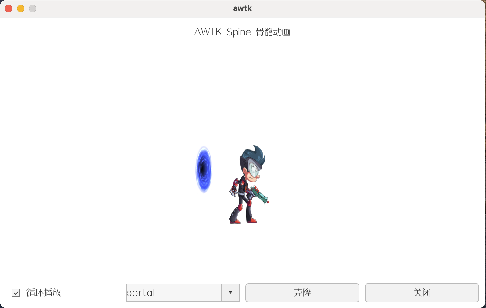

# awtk-widget-spine2d

[Spine]((https://en.esotericsoftware.com/)) 是一款广泛使用的 2D 骨骼动画工具，专为游戏开发和动态图形设计设计。它通过基于骨骼的动画系统，帮助开发者创建流畅、高效的角色动画。本项目是基于 [Spine](https://en.esotericsoftware.com/) 实现的 [AWTK](https://github.com/zlgopen/awtk) 骨骼动画控件。



## 准备

1. 获取 awtk 并编译

```
git clone https://github.com/zlgopen/awtk.git
cd awtk; scons; cd -
```

## 运行

1. 生成示例代码的资源

```
python scripts/update_res.py all
```

2. 编译

* 编译 PC 版本

```
scons
```

* 编译 LINUX FB 版本

```
scons LINUX_FB=true
```

> 完整编译选项请参考 [编译选项](https://github.com/zlgopen/awtk-widget-generator/blob/master/docs/build_options.md)

3. 运行

```
./bin/demo
```

